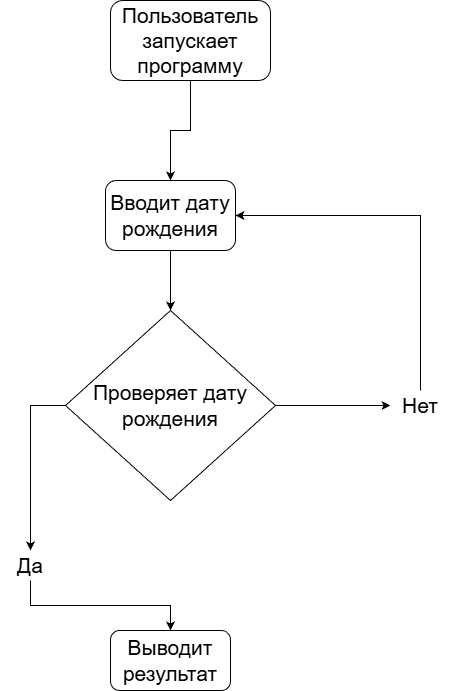

# Date of birth age verification project
Учебный проект по ОП03. Программа проверки возраста по дате рождения.
# Age verification
Учебный проект по дисциплине Основы алгоритмизации и программирования.

Программа предназначена для проверки возраста пользователей.
# Цели
* Сделать диаграмму вариантов использования
* Сделать блок-схему алгоритма
* Реализовать программу
* Оформить текст проекта
* Сделать презентацию
# Функционал
Программа позволяет:
* Ввести дату рождения
* Проверить возраст пользователя
* Выводить результат проверки
* Сохранять результат в файл log.txt
# Задачи проекта
При разработке программы были поставлены следующие задачи:
1. Проанализировать требования к системе проверки возраста
2. Изучить критерии подходящей даты рождения
3. Разработать ***Use Case диаграмму взаимодействия пользователя с системой***.
4. Разработать ***блок-схему алгоритма работы программы***.
5. Реализовать алгоритм проверки правильного сценария.
6. Создать графический интерфейс пользователя.
7. Реализовать вывод результата проверки.
8. Добавить возможность сохранения результатов проверки в файл log.txt.
9. Провести тестирование программы. 
# Date of birth age verification project
Учебный проект по дисциплине ***Основы алгоритмизации и программирования (ОП03)***.

Программа предназначена для проверки возраста пользователя по дате рождения.
# Use Case Диаграмма

# Блок схема программы

# Запуск программы

